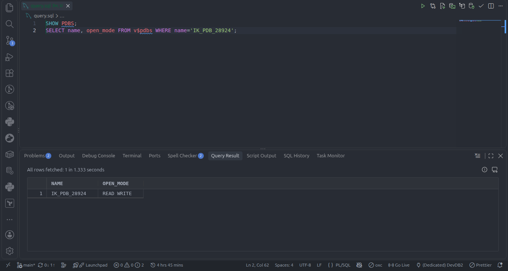
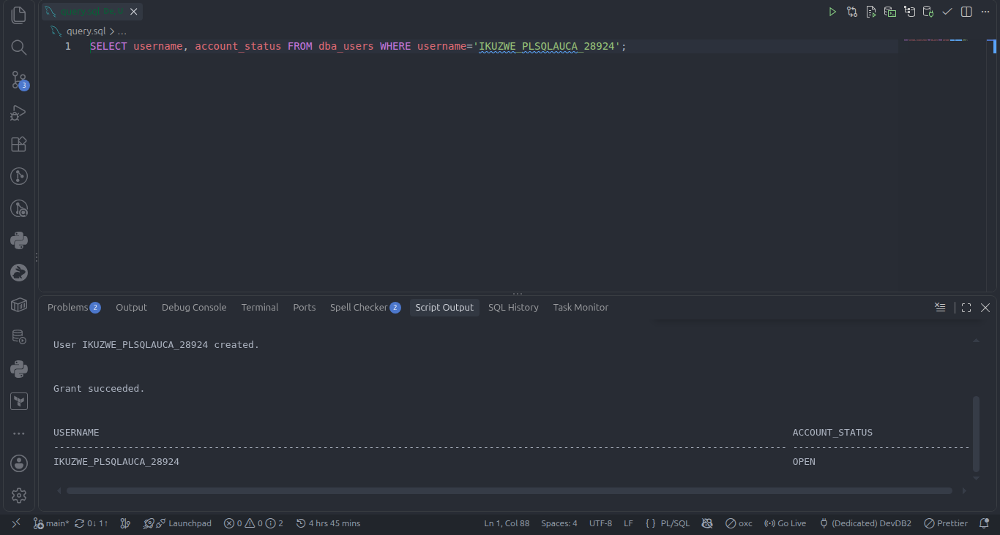
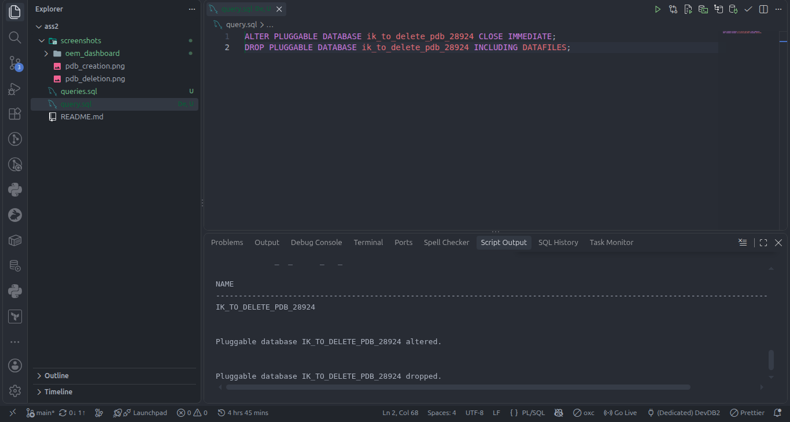
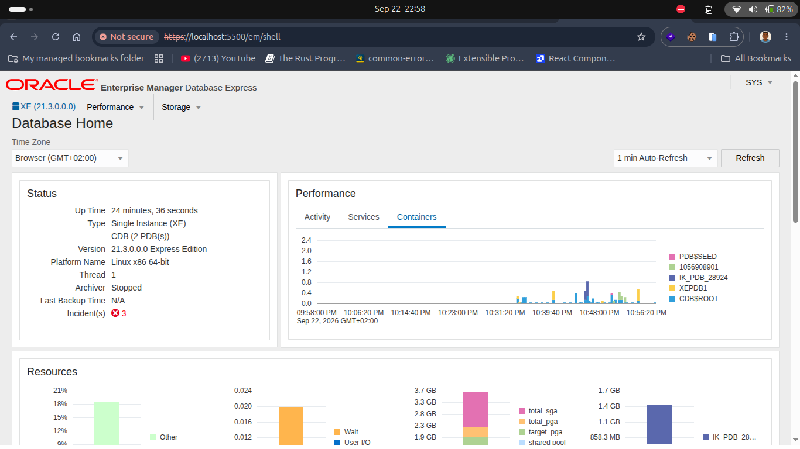

# Oracle PDB Management - Assignment II (INSY 8311)

**Name:** Ikuzwe Shema Elie

**Student ID:** 28924

**Group:** C

**Course:** Database Development with PL/SQL (INSY 8311)

**Instructor:** Eric Maniraguha

**Oracle Environment:** Oracle XE via Docker on Linux (CDB: XE/FREE - version 23)

**Oracle Sql Client:** SQL Developer vscode Extension

**Repo name:** `oracle_pdb_ass_II_28924_ikuzwe`

## Overview of Tasks

1. Task 1: Create a new Pluggable Database (PDB) + create user inside PDB for future class work.
2. Task 2: Create a temporary PDB, verify it exists, delete it completely, confirm gone.
3. Task 3: Access Oracle Enterprise Manager (OEM) dashboard showing environment + PDBs.
4. Task 4: Document all work professionally on public GitHub with screenshots.

## Task Explanations

### Task 1: Create New PDB
* PDB Name: `ik_pdb_28924`
* Username inside PDB: `ikuzwe_plsqlauca_28924`
* Steps done:
  1. Connected to CDB root as SYSDBA, checked `SHOW PDBS;`
  2. Created PDB from SEED, opened it READ WRITE, saved state.
  3. Switched to PDB, created user, granted CONNECT, RESOURCE, verified in DBA_USERS.
* Evidence:
  * PDB creation:

  

  * User inside PDB:

  

### Task 2: Create and Delete PDB
* Temp PDB Name: `ik_to_delete_pdb_28924`
* Steps done:
  1. Created temp PDB from SEED, verified with `SHOW PDBS;`
  2. Closed PDB, dropped with INCLUDING DATAFILES, verified gone with `SHOW PDBS;`
* Evidence:

  

### Task 3: OEM Setup
* Accessed OEM at `https://localhost:5500/em`, logged in, dashboard shows CDB + PDBs.
* Username visible on dashboard top-right.
* Evidence:

  

## Challenges Faced

* Could not access Enterprise Manager (OEM) on `https://localhost:5500/em` on Linux host port did not respond using official oracle docker image container-registry.oracle.com/database/free.
* Fixed by switching to a Docker image with EM Express enabled and re-creating the container with port `5500` published, then verified OEM login and PDBs on the dashboard.


## Integrity Statement
I, Ikuzwe Shema Elie (28924), declare this work is my own individual execution and documentation. No copying from classmates, no shared screenshots/repos. All screenshots are from my own Computer.

## Submission Details Block

```
Repository Link: https://github.com/shemaikuzwe/oracle_pdb_ass_II_28924_ikuzwe
PDB Name Created: ik_pdb_28924
Issues Encountered: Yes
```